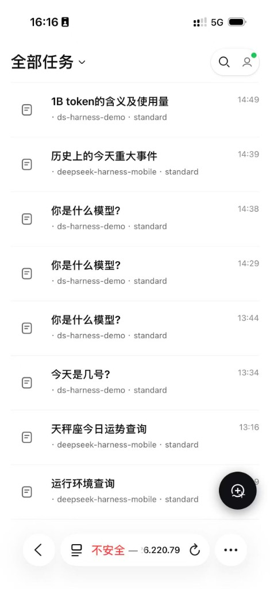
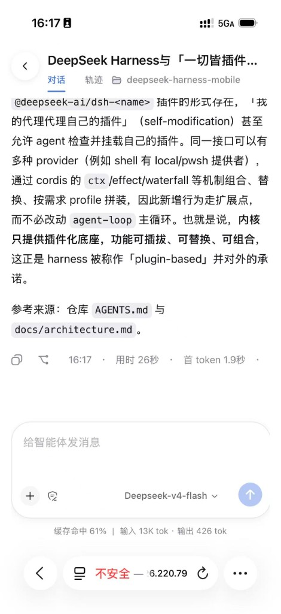
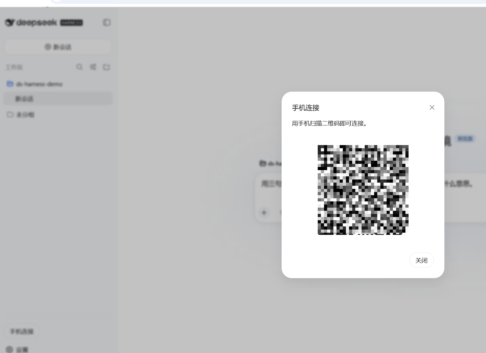
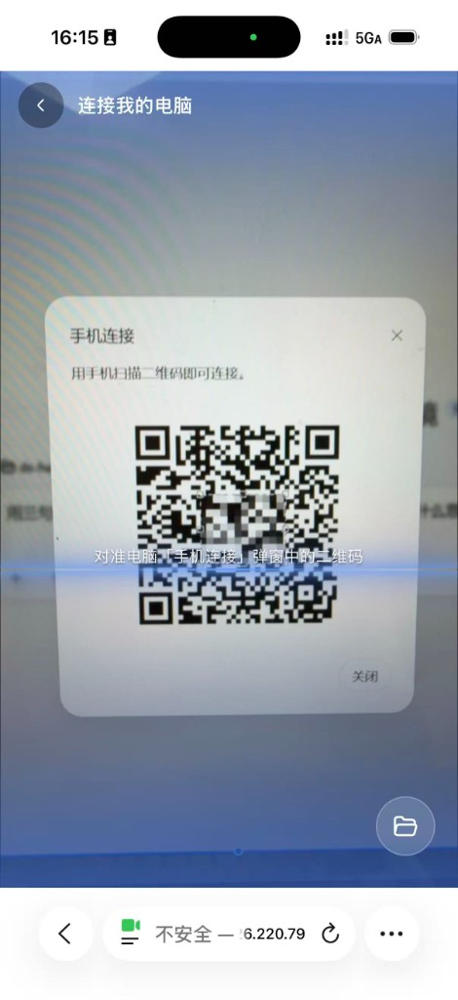
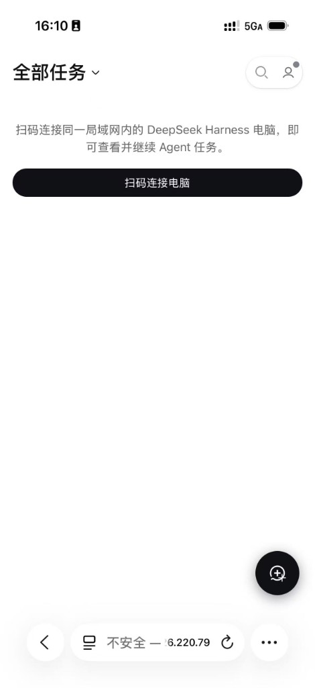
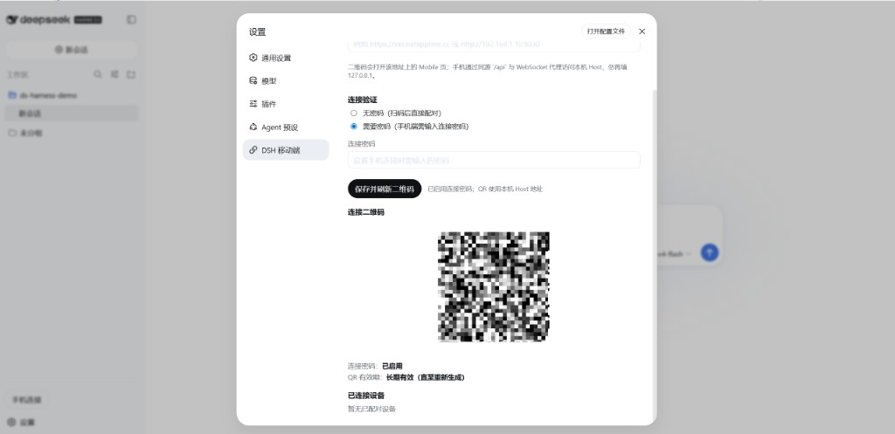
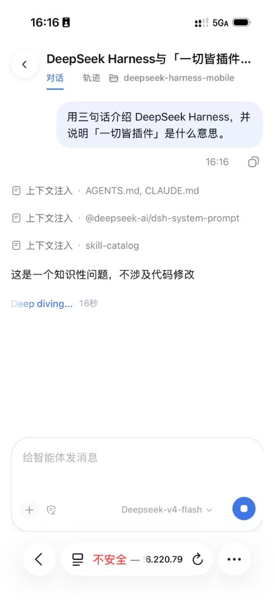

<h1 align="center">DeepSeek Harness Mobile（DSH Mobile）</h1>

<p align="center">
  <strong>面向 iOS 和 Android 的开源 DeepSeek Harness 手机端。</strong><br>
  扫码配对，无需账号。<br>
  在手机上查看任务、继续 Agent 对话。
</p>

<p align="center"><sub>基于 <a href="https://github.com/deepseek-ai/deepseek-harness">DeepSeek Harness</a> 构建的社区扩展。中文 · <a href="README.en.md">English</a></sub></p>

<p align="center">
  
  &nbsp;&nbsp;
  
</p>

<p align="center">
  <a href="https://github.com/deepseek-ai/deepseek-harness"></a>
  <a href="LICENSE"></a>
  
  
</p>

DSH Mobile 把 [DeepSeek Harness](https://github.com/deepseek-ai/deepseek-harness) 的 Agent 能力带到手机浏览器：通过局域网二维码与桌面 Host 配对，在 PWA 中浏览任务列表、进入会话、查看工具进度与轨迹。Host 仍运行在电脑上；Mobile 负责配对、连接与移动壳 UI，并通过官方插件机制与 Harness 组合。

<a id="run"></a>

## 快速开始

手机与电脑需在同一局域网，或通过手机可访问的穿透地址访问 Mobile PWA。无需注册账号。

| 端 | 地址 | 说明 |
| --- | --- | --- |
| 桌面 Host | `http://127.0.0.1:3080` | 运行 `pnpm dsh web`；侧栏 **手机连接** 展示二维码 |
| Mobile PWA | `http://127.0.0.1:8030` | 运行 `pnpm dev:mobile`；手机浏览器打开或扫码进入 |
| 局域网 | `http://<电脑 IP>:8030` | 手机只访问 Mobile；`/api` 与 WebSocket 由 Vite 代理到 Host |

### 配对步骤

1. 电脑启动 Host，手机启动 Mobile PWA（见下方「开发」）。
2. 桌面 Web 侧栏点击 **手机连接**，或进入 **设置 → DSH 移动端** 配置 **手机端访问地址** 与连接密码后保存并刷新二维码。
3. 手机打开 Mobile，扫描电脑二维码；或在配对页从相册选择二维码图片。
4. 配对成功后进入 **全部任务** 列表，点选任务继续对话。

<p align="center">
  
</p>

<p align="center">
  
  &nbsp;&nbsp;
  
</p>

穿透、短码配对、生产构建与代码地图见 [手机端开发文档](docs/mobile/README.md)。

## 文档

| 目标 | 入口 |
| --- | --- |
| 本地开发与配对细节 | [手机端开发文档](docs/mobile/README.md) |
| Host 配对 API 与配置 | [`packages/host/mobile-pairing/README.md`](packages/host/mobile-pairing/README.md) |
| 手机壳与桌面 QR 代码地图 | [手机端开发文档 — 相关代码](docs/mobile/README.md#相关代码) |
| Harness 架构与插件系统 | [架构文档](docs/architecture.md) |
| 参与上游贡献 | [CONTRIBUTING.md](CONTRIBUTING.md) |

## 主要功能

<table>
  <tr>
    <td width="50%" valign="top">
      <h3>扫码配对</h3>
      <p>桌面 Host 生成二维码与 6 位短码；手机扫码或输入短码即可配对。支持可选连接密码与桌面确认模式，无需第三方账号。</p>
      <p align="center"></p>
    </td>
    <td width="50%" valign="top">
      <h3>任务列表</h3>
      <p>iOS 风格任务首页：浏览全部或运行中任务、搜索历史会话、查看连接状态，右下角一键新建任务。</p>
      <p align="center"></p>
    </td>
  </tr>
  <tr>
    <td width="50%" valign="top">
      <h3>移动对话</h3>
      <p>在手机上发送消息、查看 Agent 回复、工具调用进度与轨迹；支持模型选择、Plan 模式与上下文统计。</p>
      <p align="center"></p>
    </td>
    <td width="50%" valign="top">
      <h3>PWA 安装</h3>
      <p>手机浏览器可添加到主屏幕，获得更接近原生 App 的全屏体验。开发模式下通过 Vite 代理访问 Host API。</p>
      <p align="center"></p>
    </td>
  </tr>
</table>

## 插件化设计

DSH Mobile 没有单独 fork 一套 Agent 运行时。Host 配对（`dsh-host-mobile-pairing`）、桌面 QR UI（`dsh-client-ui-mobile-pairing`）与手机壳（`dsh-client-mobile-shell`）都是合法的 DSH 插件，通过 `cordis.patch.yml` 与官方 Web profile 组合。会话、模型、工具与插件能力仍来自桌面 Host；Mobile 负责配对传输层与移动 presentation。

## 项目结构

Mobile 相关代码嵌在 DeepSeek Harness monorepo 中，按 Host / Client / App 三层分工：

```text
apps/mobile/                         # Mobile PWA 入口（Vite + PWA）
packages/
  host/mobile-pairing/               # Host：配对 API、二维码、短码、设备管理
  client/
    ui-mobile-pairing/               # 桌面：侧栏「手机连接」与「DSH 移动端」设置
    mobile-shell/                    # 手机：任务首页、扫码、对话、轨迹、连接管理
    connection/                      # Host↔Client 连接与会话传输
  bundle/web-app/                    # Web profile：把上述插件 patch 进官方运行时
docs/mobile/                         # 手机端开发说明
```

| 路径 | 职责 |
| --- | --- |
| `apps/mobile/` | PWA 壳、`manifest`、Vite 开发服务器；`:8030` 把 `/api` 与 WebSocket 代理到 Host `:3080` |
| `packages/host/mobile-pairing/` | `/api/mobile/*` 路由：发码、配对、确认/拒绝、设备列表与吊销 |
| `packages/client/ui-mobile-pairing/` | 桌面侧 QR Modal 与设置页（密码策略、手机端访问地址） |
| `packages/client/mobile-shell/` | 手机 UI：配对页、任务列表、Chat / 轨迹、Composer |
| `packages/client/connection/` | 配对后的 Bearer / WebSocket 连接与会话 RPC |
| `packages/bundle/web-app/` | 将 Mobile 相关插件编入 `dsh web` profile |

详细代码地图与穿透说明见 [手机端开发文档](docs/mobile/README.md)。

## 与官方项目的关系

本项目在 [deepseek-ai/deepseek-harness](https://github.com/deepseek-ai/deepseek-harness) 之上扩展手机端能力。

官方项目提供 Agent 循环、插件系统、会话持久化与桌面 Web UI。本扩展主要负责：

- 局域网 / 穿透环境下的手机配对与设备管理
- Mobile PWA 壳：任务首页、对话、轨迹与连接管理
- 桌面侧 **手机连接** 入口与 **DSH 移动端** 设置
- 手机端 `/api` 代理与 PWA 打包（`apps/mobile`）

核心 Harness 开发与 CLI 使用请优先查看[官方仓库](https://github.com/deepseek-ai/deepseek-harness)。

## 特别感谢

感谢 [DeepSeek Harness](https://github.com/deepseek-ai/deepseek-harness) 与 DeepSeek AI 团队提供的 Agent 框架与 Web UI；感谢 [Cordis](https://github.com/cordiverse/cordis) 的插件化基础；也感谢 [DSH Desktop](https://github.com/anywhere-labs/deepseek-harness-desktop) 社区在桌面体验上的探索——Mobile 与 Desktop 互补，共同把 Harness 带到更多设备。

<a id="run-from-source"></a>

## 开发

```powershell
pnpm install
pnpm run build:lib   # 首次 clone 或 pnpm run clean 之后必做

# Terminal A — Host（:3080）
pnpm dsh web

# Terminal B — Mobile PWA（:8030，/api 代理到 Host）
pnpm dev:mobile
```

`pnpm run build:lib` 按 Host → Client 顺序生成 Typert remote 契约与 client 构建产物（含 ui-theme 样式表）；跳过此步会导致 Mobile 无法加载主题 CSS 或 client 编译失败。

### 一键启动（后台运行）

`deploy/` 提供跨平台脚本，在后台启动 Host 与 Mobile PWA，并写入日志与 PID 文件（核心逻辑见 `deploy/dsh-runner.mjs`）。脚本只启动进程，不会自动构建；首次使用前请先完成上方的 `pnpm install` 与 `pnpm run build:lib`。

| 平台 | 入口 |
| --- | --- |
| Windows | `deploy\dsh.bat` |
| Linux | `./deploy/dsh.sh` |
| macOS | `./deploy/dsh.sh` 或双击 `deploy/dsh.command` |

```powershell
# 启动两者（省略 target 默认为 web + mobile）
deploy\dsh.bat start
./deploy/dsh.sh start

# 只启动其中一个
deploy\dsh.bat start web
./deploy/dsh.sh start mobile

# 停止、查看状态、跟踪日志
deploy\dsh.bat stop
deploy\dsh.bat status
deploy\dsh.bat logs
```

日志目录：`deploy/logs/`；运行态 PID：`deploy/.run/`。

生产构建：`pnpm run build:mobile`（输出 `apps/mobile/dist`）。包级测试与更多细节见 [手机端开发文档](docs/mobile/README.md) 与各包 README。

## 社区与支持

- 欢迎通过 [GitHub Discussions](https://github.com/deepseek-ai/deepseek-harness/discussions) 提交反馈或 bug 报告。
- 为你的插件仓库添加 [`dsh-plugin`](https://github.com/topics/dsh-plugin) 话题，便于被发现。
- 欢迎加入 DeepSeek Harness 企微群：扫码添加企微小助手并填写入群问卷，完成后小助手会邀请你入群。

<table>
  <thead>
    <tr>
      <th align="center">企微小助手</th>
      <th align="center">入群问卷</th>
      <th align="center">微信公众号</th>
    </tr>
  </thead>
  <tbody>
    <tr>
      <td align="center"></td>
      <td align="center"><a href="https://trtgsjkv6r.feishu.cn/share/base/form/shrcnIt5twSVdLGD52KJBckGCgg"></a></td>
      <td align="center"></td>
    </tr>
  </tbody>
</table>

## 友情链接

| 项目 | 简介 | 链接 |
| --- | --- | --- |
| DeepSeek | DeepSeek 官方网站。 | [deepseek.com](https://www.deepseek.com) |
| Linux.do 社区 | 本项目获社区认可与支持。 | [linux.do](https://linux.do) |

## License

本项目遵循 [MIT License](LICENSE)。

> 本项目是基于 DeepSeek Harness 构建的社区手机端扩展，并非 DeepSeek 官方独立产品。

> DeepSeek 是 DeepSeek AI 的商标。DSH Mobile 是社区扩展，与 DeepSeek 官方没有隶属关系，也未获得其背书。

## Star History

<a href="https://www.star-history.com/?repos=deepseek-ai%2Fdeepseek-harness&type=date&legend=top-left">
 <picture>
   <source media="(prefers-color-scheme: dark)" srcset="https://api.star-history.com/chart?repos=deepseek-ai/deepseek-harness&type=date&theme=dark&legend=top-left" />
   <source media="(prefers-color-scheme: light)" srcset="https://api.star-history.com/chart?repos=deepseek-ai/deepseek-harness&type=date&legend=top-left" />
   
 </picture>
</a>
