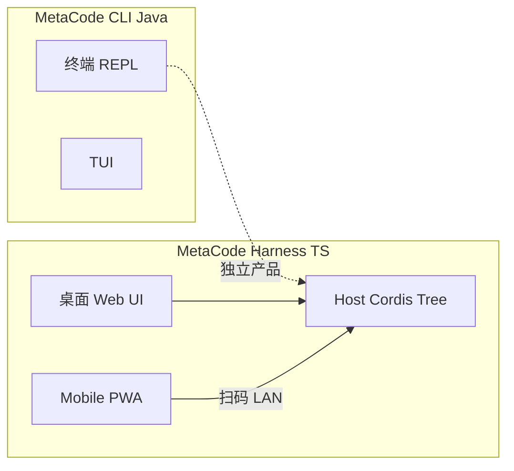

# 01 — 产品定位

[← 索引](./README.md)

## 一句话

**MetaCode Mobile** 是桌面 MetaCode Harness 的 **远程控制台**：开发者在 PC 上运行 `metacode web`，手机扫码绑定本机 Host，在移动设备上查看任务、继续 Agent 会话。

## 问题与动机

开发者使用 Harness 时常见场景：

- 离开工位但仍想查看 Agent 进度、追加一句指令
- 会议/通勤中用手机快速审批或补充上下文
- 不想依赖云端账号，希望 **数据与 Agent 循环始终在本机 Host**

Trae 等产品通过 **账号 + 云端** 连接手机与电脑。MetaCode 选择 **本地二维码配对**：零账号、零云端依赖，配对过程发生在同一局域网内。

## 用户故事

### 故事 A：首次连接

1. 开发者在 PC 执行 `metacode web`，浏览器打开桌面 Web UI
2. 点击「手机连接」，桌面弹出 **二维码**（含 LAN 地址与短期 `pairToken`）
3. 手机打开 MetaCode Mobile PWA（或浏览器访问移动页），点击「扫码连接」
4. 扫描成功后进入 **任务列表**，可看到 Host 上已有会话

### 故事 B：继续任务

1. 手机已配对，打开 App 看到最近任务
2. 点进某会话，查看流式回复与工具执行摘要
3. 在输入框发送新消息，Host 上 Agent 继续轮次
4. 回到 PC，桌面 Web UI 与会话日志一致（同一 Host、同一 session 事件流）

### 故事 C：断开与重连

1. 用户在手机「连接」页点击「断开此设备」
2. Host 撤销该设备的 `sessionToken`
3. 下次使用需重新扫码（或 Host 仍显示二维码供重扫）

## 产品边界

### M1 包含

- 桌面 **二维码生成与展示**
- 手机 **扫码配对**（无账号）
- **任务/会话列表**（基于 `ctx.sessions`）
- **单会话聊天**：发送用户消息、接收流式 assistant 回复
- **连接状态**：已绑定 Host、断线重连提示
- **PWA**：可添加到主屏幕

### M1 不包含

| 能力 | 原因 |
|------|------|
| 账号注册 / 登录 / 云端同步 | 产品差异化：本地配对 |
| Trae 式积分、插件市场、自动化 | 保持桌面专属 |
| 完整桌面 Web UI 迁移 | Mobile 做瘦壳 |
| 语音输入 | 列入 M2 |
| 公网远程访问（`0.0.0.0` 绑定） | 安全策略：仅 LAN + 令牌 |
| 手机端修改 settings / credentials | 安全：loopback-only 方法禁止 |

### M2 及以后（文档预留）

- 语音输入
- Work / Code 模式快捷切换（Agent Preset）
- 桌面「保持唤醒」提示（操作系统层，非 Harness 核心）
- 原生壳（Capacitor / React Native）包装同一 PWA

## 与 MetaCode 产品族的关系

| 产品 | 角色 |
|------|------|
| **MetaCode CLI**（Java） | 终端 REPL，对标 Claude Code 体验；不依赖本仓库 Web |
| **MetaCode Harness**（本仓库） | Cordis 插件化 Agent Harness |
| **MetaCode Mobile**（规划） | Harness **web profile** 的远程 UI，非 CLI 替代品 |

## 成功标准（M1）

- 同一 LAN 内，手机扫码后 **30 秒内** 完成配对并看到会话列表
- 手机发送一条消息后，Host 完成 **至少一个 Agent 轮次** 且回复可见
- 断开设备后，旧 `sessionToken` **无法** 再调用 `/api`
- 无需 MetaCode 账号或第三方 OAuth

## 下一步

- Trae 对标拆解：[02-trae-reference.md](./02-trae-reference.md)
- 配对协议：[03-qr-pairing-protocol.md](./03-qr-pairing-protocol.md)
