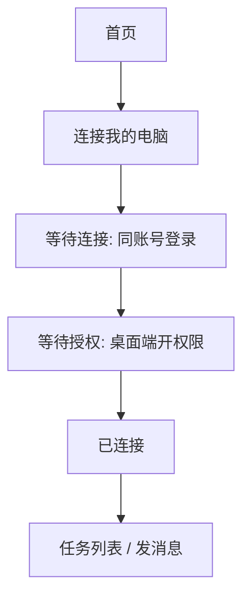
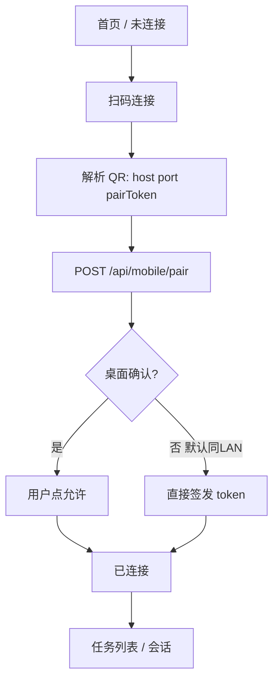
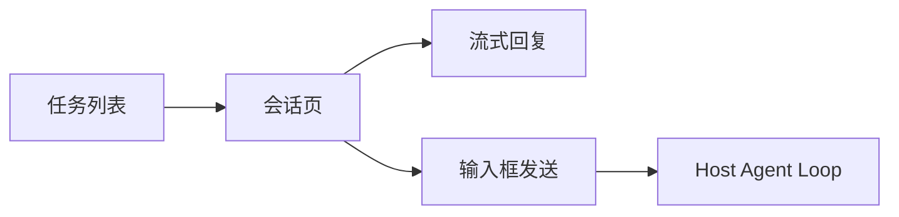

# 02 — Trae 参考与 MetaCode 取舍

[← 索引](./README.md) | [产品定位 →](./01-product-overview.md)

本文基于 Trae / TraeWork 移动端与桌面端 UI 截图，拆解能力并说明 MetaCode Mobile 的 **做 / 不做 / 延后** 决策。

## Trae 体验概览

Trae 移动端典型结构：

- **顶栏**：Work / Code 模式切换
- **首页**：问候语、快捷能力芯片（含「给电脑发消息」）
- **连接电脑**：下载桌面端、**同账号登录**、授权控制设备与保持唤醒
- **任务列表**：按文件夹/项目分组（如 `trea-mobile`）
- **会话页**：流式思考过程、搜索结果、表格回复、点赞/复制
- **输入栏**：文字、语音、模型选择（Auto Model）

Trae 桌面端补充：

- 侧栏：新建任务、插件市场、自动化、办公助理、模板库
- 任务详情与「在 VS Code 中打开」

## 能力对照表

| Trae 能力 | MetaCode M1 | 说明 |
|-----------|-------------|------|
| 同账号连接电脑 | **二维码配对** | 替代登录；见 [03-qr-pairing-protocol.md](./03-qr-pairing-protocol.md) |
| 下载 TraeWork / 分享链接 | **无需安装桌面端** | 用户已在跑 `metacode web` |
| 等待授权 / 控制当前设备 | **桌面确认 + sessionToken scopes** | 可选二次确认；默认策略可配置 |
| 保持电脑唤醒 | **M2 / OS 提示** | 非 Harness 核心；文档仅提示用户系统电源设置 |
| 任务列表 | **会话列表** | 绑定 `ctx.sessions` + workspace 标签 |
| `Work · trea-mobile` 标签 | **workspace / preset 标签** | 显示 `cwd` 或 preset 名 |
| Work / Code 切换 | **M2：Agent Preset 切换** | M1 可只读展示当前 preset |
| 流式「思考过程」 | **复用 session 事件投影** | 裁剪 Web ConversationNode，移动友好 |
| 工具/搜索中间态 | **简化展示** | M1 可折叠为「正在执行…」 |
| 语音输入 | **M2** | deferred |
| TRAE Auto Model | **只读模型名** | M1 不在手机改模型；M2 可受限切换 |
| 插件市场 / 自动化 / 模板库 | **不做** | 桌面 Web 专属 |
| 云端存储选择 | **不做** | 无账号即无云 |
| 积分激励（给电脑发消息得积分） | **不做** | 无运营体系 |

## 页面流对照

### Trae 移动：连接电脑

### MetaCode Mobile：扫码连接

### Trae 移动：会话

MetaCode M1 **复用同一会话页结构**，数据源改为 Host Typert Remote，而非 Trae 云端。

## UI 元素映射

| Trae UI | MetaCode Mobile 规划 |
|---------|---------------------|
| Work / Code 顶栏切换 | M2：Preset 切换；M1 只读 Badge |
| 「给电脑发消息，得 500 积分」芯片 | 「扫码连接电脑」芯片 |
| 「深度调研 / 数据挖掘 / 灵感创作」芯片 | M2：快捷 prompt 模板；M1 可省略 |
| 任务项 + 时间 + `Work · trea-mobile` | 会话标题 + 更新时间 + workspace 标签 |
| FAB 新建对话 | FAB 新建会话（调用 `session.create` Remote） |
| 发消息或按住说话 | M1 仅文字输入；M2 语音 |
| 云端 / 本地切换 | **仅本地 Host**（无云选项） |

## 桌面端对照

| Trae 桌面 | MetaCode 桌面（现有 + 规划） |
|-----------|------------------------------|
| 侧栏任务列表 | 现有 Web UI 侧栏 / 会话列表 |
| 插件市场等 | 现有 Web UI，Mobile 不复制 |
| 在 VS Code 中打开 | 非 M1；可与 MetaCode CLI 工作区心智对齐，后续单独规划 |
| （无） | **新增：手机连接 QR 弹层** |

## 设计原则（相对 Trae 的刻意差异）

1. **零账号**：配对即授权，不引入用户体系
2. **零云端**：Agent 与 session 数据不离开本机 Host
3. **协议复用**：不 invent 新 RPC，扩展 `/api/mobile/*` 配对面即可
4. **瘦 Mobile**：只做「看 + 说」，复杂配置回桌面

## 下一步

- 配对协议细节：[03-qr-pairing-protocol.md](./03-qr-pairing-protocol.md)
- 页面 IA：[05-ui-ia.md](./05-ui-ia.md)
