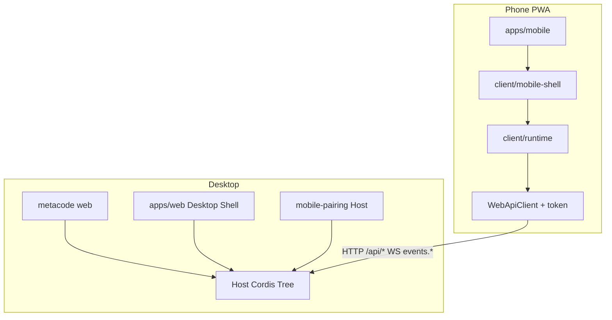
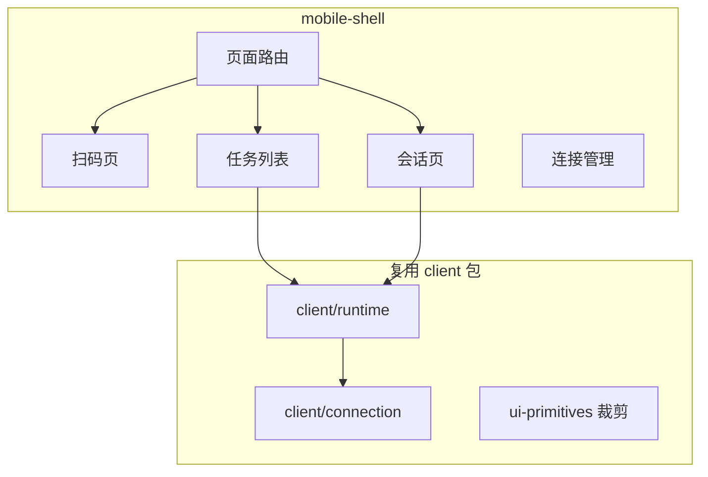
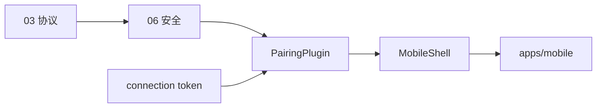

# 04 — 系统架构

[← 索引](./README.md) | [配对协议 →](./03-qr-pairing-protocol.md)

## 总览

MetaCode Mobile **不新建平行 Agent 协议**，在现有 Host↔Client 栈上增加 **配对层** 与 **移动 UI 壳**。



## 现有模块复用

| 模块 | 路径 | Mobile 用法 |
|------|------|-------------|
| 连接层 | `packages/client/connection` | `WebApiClient` 携带 `Authorization`；移动端 `ConnectionController` 连续重连 3 次失败后放弃并清除配对 |
| 运行时 | `packages/client/runtime` | `SessionManager`、workspace 投影不变 |
| RPC 网关 | `packages/api/gateway` | Typert `@Remote` 方法手机端直接调用 |
| Remote 定义 | `packages/api/remotes` | 会话列表、发消息等已有 Remote |
| 桌面 Shell | `packages/client/web` | 启动流程、`BootManifest` 解析可参考 |
| 模块加载 | `packages/client/modules` | Mobile 可复用 `ClientModuleSystem`，裁剪 plugin 表 |
| Web 前端 | `apps/web` | 桌面不变；新增 QR 弹层组件 |
| Web 服务器 | `packages/host/webserver` | 继续承载 `/api` 与静态资源 |
| Trust fence | `packages/client/connection/src/api-request-trust.ts` | 扩展 mobile token 校验 hook |

### 现有 Host↔Client 数据流（不变部分）

```text
Phone Mobile UI
  → ctx.connection (WebApiClient + token)
  → HTTP POST /api/<remoteMethod>
  → Typert gateway intercept
  → Host service (sessions, agents, …)
  → session/event → WS events.mux / events.host
  → Client SessionRuntime 投影 UI
```

## 规划新增模块

| 模块 | 建议路径 | 职责 |
|------|----------|------|
| `@metacode/mobile-pairing` | `packages/host/mobile-pairing` | pairToken/sessionToken 生命周期、设备注册表、`/api/mobile/*` 路由 |
| `@metacode/client-mobile-shell` | `packages/client/mobile-shell` | 移动布局、页面路由、扫码 UI、会话列表/聊天页 |
| `@metacode/mobile-app` bundle | `packages/bundle/mobile-app` | Cordis patch：挂载 pairing + 可选 mobile 静态路由 |
| `apps/mobile` | `apps/mobile` | Vite PWA 入口，`AppMobileEntry.run()` |

### 可选：与 `apps/web` 合并

M1 也可在 `apps/web` 增加路由 `/m/*`，共用构建与 `__METACODE_BOOT__`（重命名后）。独立 `apps/mobile` 利于 PWA manifest 与包体积控制。**实现阶段二选一**；文档默认 **独立 `apps/mobile`**。

## Cordis 组合

在 **web profile** 的 patch 层增加（示意）：

```yaml
- insert:
    - id: mobile-pairing
      name: '@metacode/mobile-pairing'
    - id: mobile-static
      name: '@metacode/host-mobile-static'
      inject: [webStartup]
      config:
        mountPath: /m
```

`mobile-pairing` 注册：

- `/api/mobile/pair` 等路由（在 connection 的 `/api` 分发前或作为 Typert 外 HTTP handler）
- `ctx.mobilePairing` 服务供桌面 UI 调用

## 桌面 QR UI 落点

| 方案 | 说明 |
|------|------|
| A（推荐 M1） | 在现有 Web UI 顶栏增加「手机连接」→ Modal 展示 QR + 已连接设备 |
| B | 独立页面 `/mobile/pair` |
| C | CLI TUI（后期） |

QR 数据来自 Host `ctx.mobilePairing.createPairing()`，前端仅渲染。

## Mobile Shell 分层



M1 **不** 加载完整桌面 `ui-*` roster；仅引入会话消息列表的最小 ConversationNode 子集。任务列表用头像角标表示连接状态（绿=已连接，红=已配对但断开），不挂 `ConnectionBanner`。

## CLI 扩展（规划）

| 命令 /  flag | 说明 |
|--------------|------|
| Web UI 按钮 | M1 主入口 |
| `metacode web --mobile-pair` | 启动后自动打开 QR Modal（可选） |
| `metacode mobile devices list` | M2：终端查看已配对设备 |

## 与 `--host` / `trustedHosts`

[`web-app/startup.ts`](../../packages/bundle/web-app/src/startup.ts) 当前：

- 拒绝 `--host 0.0.0.0`
- 非 loopback 绑定时推导 LAN IP 写入 `trustedHosts`

Mobile 要求 Host **监听 LAN 可达地址**（如 `192.168.x.x:3080`），否则手机无法连接。规划：

- 文档与 UI 提示：「手机连接需 Host 绑定局域网地址」
- 可选 flag：`--host 192.168.x.x` 或自动选默认非 loopback 接口（**实现时谨慎**，保持显式配置优先）

## 测试策略（实现阶段）

| 层 | 测法 |
|----|------|
| pairing 协议 | Host 单测 + HTTP 契约测试 |
| trust + token | 复用 `packages/client/connection/tests` 模式扩展 |
| Mobile UI | Playwright mobile viewport；扫码用 fixture payload 注入 |
| E2E | 同 LAN 两进程：Host + 移动浏览器 |

## 依赖关系



## 下一步

- UI IA：[05-ui-ia.md](./05-ui-ia.md)
- 安全：[06-security.md](./06-security.md)
- 排期：[07-m1-roadmap.md](./07-m1-roadmap.md)
