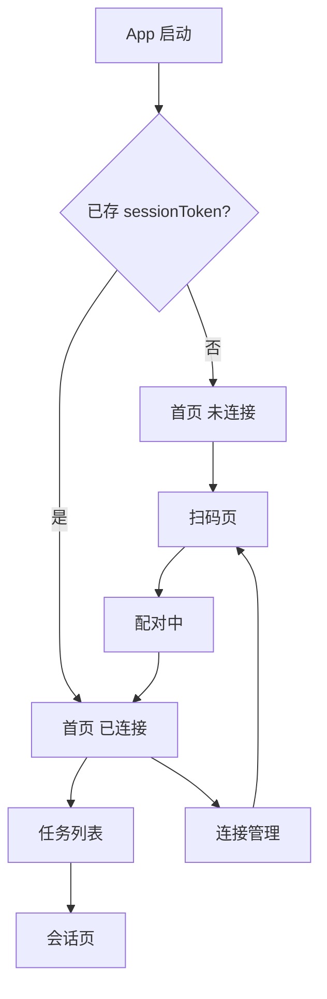

# 05 — 信息架构与页面流

[← 索引](./README.md) | [系统架构 →](./04-architecture.md)

本文描述 MetaCode Mobile PWA 的页面结构，对标 Trae 移动截图，并标注 M1 实现范围。

## 导航模型

M1 采用 **单栈导航 + 系统返回**，不做底部 Tab（降低实现量）。M2 可改为 Tab：「任务 | 连接」。

## 页面规格

### 1. 首页（未连接）

**对标 Trae**：问候语 + 快捷芯片。

| 元素 | 说明 | M1 |
|------|------|-----|
| 顶栏 | 标题 MetaCode；无 Work/Code | 只读 Badge 显示当前 preset（若已知） |
| 问候 | 「MetaCode 今天能帮你做什么？」 | 是 |
| 主 CTA | 「扫码连接电脑」 | 是 |
| 次 CTA | 深度调研 / 数据挖掘等 | 否（M2 模板） |
| 最近任务 | 灰态占位「连接后可见」 | 是 |

### 2. 首页（已连接）

| 元素 | 说明 |
|------|------|
| 连接条 | 绿点 + Host 名 + `192.168.x.x:3080` |
| 最近任务 | 最多 5 条，点击进入会话 |
| 查看全部 | 进入任务列表 |

### 3. 扫码页

**对标 Trae**：「连接我的电脑」但 **无账号步骤**。

| 元素 | 说明 |
|------|------|
| 相机预览 | `getUserMedia` 或调用系统扫码（PWA 限制时用 input file） |
| 相册选图 | 解析 QR 静态图 |
| 手动连接 | 展开表单：Host、Port、6 位配对码 |
| 帮助 | 「在电脑 metacode web 界面点击手机连接」 |

**流程**：

1. 解析 QR → 校验 `expiresAt`
2. 显示「正在连接…」
3. 若 409 pending → 「请在电脑上确认」+ 轮询
4. 成功 → 写入 localStorage → 跳转任务列表

### 4. 连接管理页

**对标 Trae**：连接状态 + 权限说明（MetaCode 版无「保持唤醒」开关，仅文案提示）。

| 元素 | 说明 |
|------|------|
| 当前 Host | 名称、fingerprint、连接时间 |
| 权限摘要 | 已授予 scopes 列表 |
| 断开连接 | 清除本地 token + 可选通知 Host 吊销 |
| 重新扫码 | 跳转扫码页 |

Trae「允许控制当前设备 / 保持唤醒」→ MetaCode 改为：

- 「已授权：查看与继续 Agent 任务」
- 「未授权：修改系统设置与凭证（仅桌面）」

### 5. 任务列表页

**对标 Trae**：全部任务 + FAB。

| 元素 | 说明 |
|------|------|
| 顶栏 | 「全部任务」+ 搜索（M2） |
| 列表项 | 会话标题、更新时间、workspace 标签（如 `Work · my-project`） |
| 空态 | 「暂无任务，点击 + 新建」 |
| FAB | 新建会话（`session.create` Remote） |

列表数据源：Host `@Remote` 会话枚举（与桌面 Web 会话列表同源）。

### 6. 会话页

**对标 Trae**：聊天 + 流式回复。

| 元素 | 说明 | M1 |
|------|------|-----|
| 顶栏 | 任务标题、Host 名 | 是 |
| 消息区 | user / assistant 气泡 | 是 |
| 流式 | assistant/chunk 增量 | 是 |
| 思考过程 | Trae「思考过程」折叠块 | 简化：「Agent 正在工作…」 |
| 工具卡片 | 桌面 Rich Node | 纯文本摘要 |
| 输入栏 | 多行文本 + 发送 | 是 |
| 语音 | 按住说话 | M2 |
| 模型 | Auto Model 下拉 | M1 只读 |

**交互**：

- 发送 → Host 注入 user message → 触发 Agent 轮次（与桌面一致）
- 加载中禁用发送；支持停止（M2：`agent.cancel`）

### 7. 桌面 QR 弹层（Web UI）

不在 Mobile App 内，属 **桌面 Web UI** 组件。

| 元素 | 说明 |
|------|------|
| QR 码 | 动态刷新，TTL 倒计时 |
| LAN 地址 | 明文 `https://192.168.x.x:3080` 供手动输入 |
| 已连接设备 | 列表 + 吊销按钮 |
| pending | 「iPhone 请求连接 [允许] [拒绝]」 |

## 布局与样式

- **Viewport**：移动优先，`max-width: 100%`，安全区 `env(safe-area-inset-*)`
- **字体**：与桌面 design token 对齐（`packages/client/ui-primitives` 变量子集）
- **不复用**桌面侧栏、多栏布局
- **深色模式**：M2；M1 可仅浅色

## 关键用户路径（验收用）

| ID | 路径 | 步骤 |
|----|------|------|
| P1 | 首次配对 | 桌面出 QR → 手机扫 → 见任务列表 |
| P2 | 续聊 | 列表 → 会话 → 发消息 → 见流式回复 |
| P3 | 断开后重连 | 连接管理 → 断开 → 扫码 → 恢复 |
| P4 | 桌面拒绝 | 扫 QR → 桌面拒绝 → 手机错误提示 |

## 无障碍

- 扫码页提供手动输入（不依赖相机）
- 连接状态不仅依赖颜色，含文字标签
- 发送按钮具备 loading / disabled 态

## 下一步

- 安全约束对 UI 的影响：[06-security.md](./06-security.md)
- 排期：[07-m1-roadmap.md](./07-m1-roadmap.md)
