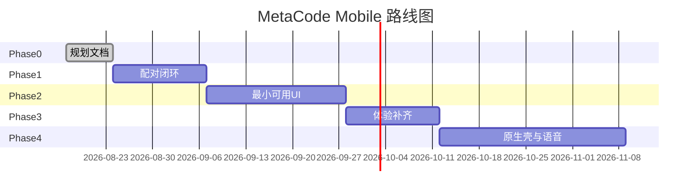

# 07 — M1 路线图与验收

[← 索引](./README.md) | [安全设计 →](./06-security.md)

## 阶段总览



## Phase 0 — 规划文档（已完成）

**交付物**：

- `docs/mobile/*.md` 全套
- 根 README 链接
- 评审记录（PR 或 Issue 讨论）

**出口标准**：产品/安全/架构评审通过，四项待确认项有结论（见 [README.md](./README.md)）。

---

## Phase 1 — 配对闭环（已完成）

**目标**：手机扫码后，`host.describe` 成功，双 WebSocket 连通。

### Host

| 任务 | 包/文件 |
|------|---------|
| `mobile-pairing` 插件骨架 | `packages/host/mobile-pairing` |
| `POST /api/mobile/pair` | 同上 |
| pairToken  mint / consume | 同上 |
| sessionToken 存储与 scope | 同上 |
| 扩展 trust fence 或 gateway hook | `connection` / `gateway` |
| 桌面 QR Modal | `packages/client/ui-*` 或 `apps/web` |

### Client

| 任务 | 包/文件 |
|------|---------|
| 扫码页（手动输入降级） | `packages/client/mobile-shell` |
| `WebApiClient` 带 Bearer | `packages/client/connection` |
| WS query token | `connection` |
| localStorage 持久化 | `mobile-shell` |
| `apps/mobile` Vite 入口 | `apps/mobile` |

### 验收

- [x] 桌面展示 QR，TTL 倒计时正确
- [x] 手机扫码后 pairing API 返回 sessionToken
- [x] `host.describe` 200
- [x] `/api/events.mux` 与 `/api/events.host` WS 均为 open
- [x] 过期/重用 pairToken 失败
- [x] strict 模式下未确认无法完成配对

---

## Phase 2 — 最小可用 UI（已完成）

**目标**：完成一次完整 Agent 轮次（手机发消息 → assistant 流式回复）。

### 功能

| 任务 | 说明 |
|------|------|
| 会话列表 Remote 对接 | 复用 desktop 同源 API |
| 会话页消息投影 | 最小 message 渲染 |
| 发送 user message | Remote 或等价路径 |
| ConnectionBanner 移动版 | 断线重连 |
| 新建会话 FAB | `session.create` |

### 验收

- [x] 列表展示 Host 上至少一个 session
- [x] 进入会话可见历史消息
- [x] 发送消息后 Host Agent loop 运行
- [x] 手机可见流式 assistant 文本
- [x] 桌面 Web 同 session 日志一致

---

## Phase 3 — 体验补齐（已完成）

| 任务 | 说明 |
|------|------|
| 桌面设备管理 UI | 列表 + 吊销 |
| PWA manifest + icons | `apps/mobile` |
| 添加到主屏幕引导 | 首次连接后提示 |
| Work/Code preset Badge | 只读展示 |
| 错误态与空态打磨 | `StatusPanel` + ConnectionBanner |
| 6 位短码手动配对 | 相册 QR + 手动表单 |
| Agent 停止 | `sessions.cancel` |
| 深色模式 | light/dark/system |

### 验收

- [x] PWA manifest + service worker（可安装基线）
- [x] 吊销设备后手机 401 清凭证
- [ ] Lighthouse PWA 全绿（待 CI/手工 Lighthouse）
- [ ] 主要路径 P1–P4 手工回归清单

---

## Phase 4 — 可选增强

| 任务 | 说明 |
|------|------|
| Capacitor / RN 壳 | 深度链接 `metacode://pair` |
| 语音输入 | 语音识别 → user message |
| 推送通知 | Host 任务完成通知（需 OS 权限） |
| mDNS `metacode.local` | QR 可读主机名 |
| refreshToken | 长连不断扫码 |

---

## 依赖顺序

```text
03 协议定稿 → 06 安全评审 → 04 模块拆分
  → Phase1 Host pairing + connection 扩展
  → Phase1 apps/mobile 扫码
  → Phase2 runtime 对接
  → Phase3 体验
```

## 风险与缓解

| 风险 | 缓解 |
|------|------|
| PWA 相机权限受限 | 手动 host:port + 短码 |
| LAN IP 变化 | QR 实时刷新；提示重新扫码 |
| 移动 WebSocket 休眠 | ConnectionBanner + 可见时重连 |
| 桌面 bundle 过重 | Mobile 独立 roster，不加载全 ui-* |
| rename 未完成（dsh 残留） | 实现前完成 `@metacode/*` 一致性扫描 |

## 文档维护

- 协议变更 bump `payload.v`
- 实现 PR 须更新对应 `docs/mobile` 章节或标注「已实现偏差」
- 与 `docs/architecture.md` 交叉链接 Host↔Client 章节

## 评审检查清单（回顾）

请在 Phase 0 结束前确认：

1. **LAN vs mDNS**：QR 是否写 IP 即可，还是必须 `metacode.local`
2. **PWA vs 原生**：M1 是否锁定 PWA
3. **桌面确认**：strict / trusted-lan / off 默认值
4. **M1 范围**：是否必须新建任务与 preset 切换，还是 Phase 2 仅续聊

确认后在本 README 或 Issue 中记录结论，再启动 Phase 1 代码。
